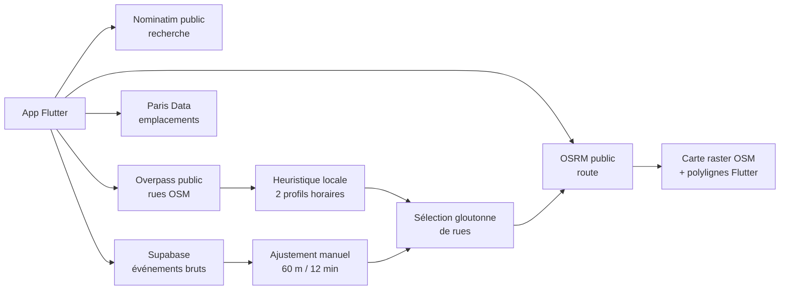
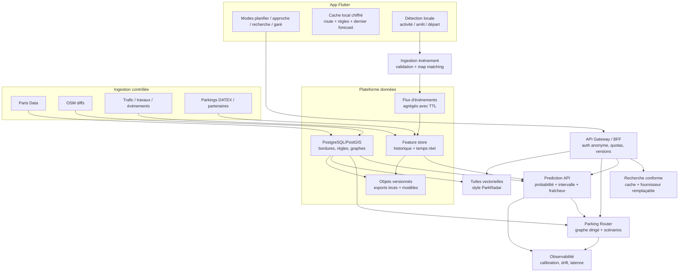

# ParkRadar — étude stratégique, fiabilité prédictive et expérience cartographique

> Version 2.0 — 15 juillet 2026  
> Périmètre : application Flutter `parking-app/app`, build web publié, iOS, données Paris, moteur de probabilité, boucle de recherche et couche communautaire.  
> Objet : définir ce qu'il faut réellement construire et mesurer pour faire de ParkRadar une référence du stationnement en voirie, avec une qualité comparable aux meilleures applications de navigation.

---

## 0. Résumé exécutif

### Verdict

ParkRadar répond à un problème réel et conserve une fenêtre de différenciation forte. En mai 2026, Waze indiquait encore officiellement ne pas prendre en charge la navigation vers le stationnement en voirie. Son produit « parking » reste centré sur les parkings hors voirie et n'est pas disponible dans CarPlay/Android Auto pour ce parcours. ParkRadar peut donc posséder le « dernier kilomètre » que les GPS généralistes traitent mal : **choisir une zone, chercher intelligemment, respecter les règles, se garer, puis finir à pied**.

Le dépôt actuel est un **bon prototype fonctionnel** : le code s'analyse sans erreur et ses 34 tests unitaires passent. En revanche, il n'est pas encore possible de qualifier ses pourcentages de prédictions fiables : ils proviennent d'une heuristique non entraînée et non calibrée, sans vérité terrain. L'itinéraire affiché est une polyligne statique passant par des milieux de rues, pas encore un guidage dynamique comparable à Waze. La couche dite « en direct » ne s'abonne à aucun flux temps réel. Enfin, plusieurs dépendances publiques actuelles ne sont pas autorisées ou suffisamment garanties pour une application de production.

La priorité n'est donc pas d'ajouter immédiatement un modèle profond ou davantage de couleurs. Il faut franchir, dans l'ordre, quatre seuils :

1. **Honnêteté et conformité** : supprimer les promesses trompeuses, sécuriser la géolocalisation, respecter les licences et remplacer les services publics sans SLA.
2. **Vérité cartographique** : construire des segments de bordure légaux, par côté de rue, avec capacités et règles temporelles réelles.
3. **Mesure et calibration** : collecter une vérité terrain, entraîner un modèle simple mais robuste, calibrer ses probabilités et publier son incertitude.
4. **Guidage adaptatif** : optimiser le coût total conduite + recherche + marche, observer les rues parcourues et recalculer en continu.

### Évaluation qualitative de l'état actuel

| Dimension | État actuel | Niveau nécessaire avant promesse grand public |
|---|---|---|
| Proposition produit | Différenciante et compréhensible | Affiner autour de « recherche fiable + règles + plan B » |
| Données statiques | OSM + open data Paris affichés séparément | Référentiel de bordures fusionné, versionné et contrôlé |
| Prédiction | Deux profils horaires et facteurs manuels | Modèle appris, probabilités calibrées, incertitude publiée |
| Temps réel | Lecture ponctuelle d'événements anonymes | Flux validé, map-matché, pondéré, protégé contre l'abus |
| Routage | Sélection gloutonne puis route via midpoints | Graphe dirigé, coût stochastique et recalcul en horizon glissant |
| Navigation | Tracé de route sans instructions | Position continue, map matching, voix, manœuvres et repli |
| Carte/UX | Démo lisible mais très chargée | Carte vectorielle dédiée, modes conduite, responsive, accessible |
| Fiabilité logicielle | 34 tests unitaires, analyse propre | Tests widget, golden, contrats, intégration, terrain et CI |
| Infrastructure | APIs publiques appelées directement | Backend contrôlé, cache, quotas, observabilité et SLO |
| Vie privée/sécurité | Coordonnées exactes publiques dans Supabase | Événements agrégés par segment, TTL, RPC, rate limiting et contrôle utilisateur |

### Résultat cible crédible

Une bêta Paris réellement défendable peut viser, après collecte terrain :

- une **probabilité calibrée** : quand l'app annonce 60 %, environ 60 % des cas comparables doivent réussir, avec une erreur de calibration globale inférieure à 5 points ;
- au moins **15 % d'amélioration du Brier score** contre un prior heure × quartier, sur un test temporel et spatial tenu à l'écart ;
- une réduction d'au moins **20 % du temps médian de recherche**, et une amélioration du P90, face à un parcours direct vers la destination ;
- **99,9 %** de disponibilité pour les APIs essentielles, une prédiction servie en moins de 200 ms au P95 depuis le cache et un routage en moins d'une seconde au P95 dans la zone pilote ;
- aucune formulation de type « 100 % » tant que le résultat n'est pas issu d'un modèle calibré et accompagné de son niveau de confiance.

Ces cibles sont des **portes de sortie de bêta**, pas des résultats déjà obtenus.

---

## 1. Méthode et périmètre de l'audit

L'étude combine :

- une revue ligne par ligne des modèles, services, tests, configurations web/iOS/Android et du schéma Supabase ;
- l'exécution de `flutter analyze` et `flutter test` avec Flutter 3.44.6 / Dart 3.12.2 ;
- un audit visuel de la version publiée sur un viewport mobile 390 × 844 et desktop 1440 × 900 ;
- une recherche de sources officielles datée de juillet 2026 : Ville de Paris, OpenStreetMap Foundation, CNIL, Waze, Apple, Google for Cars, Flutter, MapLibre, OSRM, INRIX, Parknav, SpotAngels et Seety ;
- une revue de travaux scientifiques sur la prévision spatio-temporelle, l'incertitude et le routage probabiliste.

### Limite de cette étude

Il n'existe dans le dépôt ni historique d'occupation réel, ni journal de sessions de recherche, ni comparaison terrain. Cette étude peut donc auditer la formule et concevoir un protocole, mais **elle ne peut pas valider la précision actuelle**. La première preuve sérieuse sera une campagne de données et une expérimentation contrôlée, non une impression visuelle de la heatmap.

---

## 2. État réel du produit actuel

### 2.1 Architecture actuelle



Le prototype fonctionne sans backend métier : les calculs ont lieu dans l'application et celle-ci appelle directement cinq services externes. C'est rapide pour valider une idée, mais cela empêche de garantir quotas, cache, données cohérentes, observabilité et changements de fournisseur sans mise à jour de l'app.

### 2.2 Ce qui est déjà bien fait

- Les services sont séparés du modèle et plusieurs acceptent un `http.Client`, ce qui facilite les tests.
- L'application dégrade proprement certaines couches optionnelles quand Paris Data ou Supabase échouent.
- Le moteur et le planificateur sont déterministes, rapides et couverts par des tests unitaires.
- La carte possède déjà les briques du concept : destination, score par rue, boucle, régimes, position, événements et route.
- L'application évite de présenter la probabilité cumulée directement dans le cercle principal ; l'intention d'honnêteté est présente dans le commentaire du code.
- Les polices sont embarquées et CanvasKit est auto-hébergé, ce qui réduit deux dépendances réseau du build web.

### 2.3 Blocages P0 découverts

| Blocage | Preuve dans le code | Conséquence |
|---|---|---|
| Autocomplétion Nominatim publique interdite | `map_screen.dart:75-93` déclenche une recherche après 450 ms ; `geocoding_service.dart:21-33` appelle `nominatim.openstreetmap.org` | Risque de blocage de l'app ; la politique Nominatim interdit explicitement l'autocomplétion côté client |
| Régimes réels déconnectés du score | `_recompute`, `map_screen.dart:129-142`, n'utilise jamais `_parisSpots`; ceux-ci ne servent qu'au rendu `381-390` | Une rue peut être recommandée alors que les emplacements visibles sont livraison, deux-roues, handicap ou interdits |
| Pourcentages non calibrés présentés comme précis | `probability_engine.dart:18-45, 90-103`; `map_screen.dart:683-735` | « 100 % » et « très bonnes chances » peuvent être perçus comme une promesse sans fondement terrain |
| « En direct » sans temps réel | `map_screen.dart:145-155` charge une fois, puis seulement après un signalement ; aucune souscription ni polling | Libellé trompeur, événements périmés à l'écran, pas de réacheminement dynamique |
| État de l'ancienne destination conservé | `_selectDestination`, `map_screen.dart:98-108`, purge rues/route mais pas `_communityEvents` ni `_parisSpots`; les appels n'ont pas d'identifiant de génération | Des règles ou signalements de la destination précédente peuvent rester affichés, et une réponse tardive peut écraser le nouvel état |
| Faux départ de guidage sans GPS | `_startGuidance`, `map_screen.dart:225-227`, utilise la destination comme point de départ quand la position échoue | Une prévisualisation locale peut être prise pour un guidage depuis la position réelle du conducteur |
| Coordonnées communautaires exactes publiquement lisibles et insérables | `supabase/schema.sql:21-31`; `community_service.dart:45-117` | Vie privée, scraping, spam et manipulation massive du score |
| Attribution OSM absente de la carte | `map_screen.dart:363-366` et audit visuel | Non-respect de la politique des tuiles et de l'ODbL |
| Dépendances publiques sans SLA | tuiles OSM, Overpass et serveur de démonstration OSRM codés en dur | Une panne ou un blocage externe coupe une fonction centrale sans contrôle ni repli |
| Zoom web désactivé | `web/index.html` contient `maximum-scale=1.0, user-scalable=no` | Échec d'accessibilité pour les utilisateurs ayant besoin d'agrandir l'interface |

La politique du serveur public Nominatim fixe un maximum absolu d'une requête par seconde pour l'ensemble de l'application et interdit l'autocomplétion. Elle recommande également un proxy, un cache et la possibilité de changer de fournisseur sans nouvelle version : [Nominatim Usage Policy](https://operations.osmfoundation.org/policies/nominatim/).

La politique des tuiles OSM exige une attribution visible, du cache, une identification correcte et précise que le service est « best effort » sans SLA : [OSM Tile Usage Policy](https://operations.osmfoundation.org/policies/tiles/).

Le dépôt OSRM présente `router.project-osrm.org` comme un serveur de démonstration ; les mainteneurs ont historiquement rappelé qu'il ne donne aucune garantie et recommandent l'auto-hébergement ou un fournisseur pour la production : [OSRM backend](https://github.com/Project-OSRM/osrm-backend), [discussion du serveur de démonstration](https://github.com/Project-OSRM/osrm-backend/issues/1873).

### 2.4 Défauts importants P1

#### Géométrie et capacité

- Une `StreetSegment` correspond à un *way* OSM entier, pas à un côté de pâté de maisons. Le way n'est ni coupé aux intersections ni limité exactement au rayon demandé.
- `distanceTo` mesure la distance aux sommets et non la projection sur les segments de polyligne. Un événement situé au milieu d'une longue rue peut donc être considéré trop loin.
- La capacité est `longueur × 0,65 / 5,5 × côtés`, sans soustraire précisément entrées, passages piétons, arrêts, livraisons, terrasses, travaux et règles horaires.
- Le dataset Paris actuellement appelé décrit principalement des **points d'emplacement**. Le code transforme chaque point en un petit segment fictif orienté au nord (`paris_parking_service.dart:135-143`). Il ne dessine donc pas une emprise réelle de bordure.
- L'appel limite les résultats à 100 (`paris_parking_service.dart:56-60`) sans pagination. Dans une zone dense, la couche est tronquée silencieusement.
- Le résumé de régime compte les objets renvoyés et non le nombre réel de places. Un enregistrement n'équivaut pas nécessairement à une place automobile disponible pour cet utilisateur.

#### Prédiction et temps

- Deux profils seulement représentent tout Paris : résidentiel et « mixte/animé ».
- Le `findabilityFactor = 2.5` est un réglage manuel ajouté pour rendre le curseur visuellement plus sensible, pas un paramètre appris.
- Le curseur choisit une heure du jour courant, même si cette heure est déjà passée ; il n'offre ni date, ni durée d'approche, ni heure d'arrivée par rue.
- Jours fériés, vacances, météo, marchés, concerts, travaux, trafic, prix, règles, saison et arrondissement sont absents.
- Le score d'une grande rue augmente mécaniquement avec sa longueur, alors que l'utilisateur n'en parcourra peut-être qu'une fraction et que les places sont spatialement corrélées.

#### Routage

- La « boucle » n'est pas garantie fermée. Elle trie des rues par `p × proximité`, puis ordonne leurs milieux au plus proche voisin à vol d'oiseau.
- Le graphe routier, les sens uniques et les interdictions de tourner ne participent pas à la sélection.
- Le calcul cumulé suppose l'indépendance des rues. En pratique, une saturation de quartier corrèle fortement les échecs et gonfle le résultat.
- Le planificateur peut sélectionner huit segments, mais le routage n'en envoie que six à OSRM (`map_screen.dart:228-232`).
- Le temps de recherche additionne seulement la longueur des rues à 20 km/h ; il ignore les liaisons, l'approche, les feux, le trafic et la marche.
- Le « guidage » ne suit pas la position, ne map-matche pas le véhicule, n'affiche ni manœuvres ni instructions vocales et ne recalcule pas après une rue ratée.

#### Réseau et état applicatif

- Les appels HTTP n'ont généralement ni délai maximal explicite, ni retry borné, ni cache, ni circuit breaker.
- Une réponse ancienne de géocodage peut remplacer une réponse plus récente : les requêtes en vol ne sont pas annulées ou identifiées.
- Lors d'un changement de destination, les places Paris et événements communautaires précédents ne sont pas purgés atomiquement ; les réponses tardives ne sont pas rejetées par `destinationId`/`requestId`.
- Si le GPS est refusé ou indisponible, le bouton de guidage calcule depuis la destination sans expliquer qu'il s'agit seulement d'un aperçu.
- Les erreurs de couches optionnelles sont souvent entièrement silencieuses ; l'utilisateur ne sait pas si les données sont absentes ou si tout est réellement vide.
- Les clients HTTP ne sont pas fermés.
- `MapScreen` concentre environ 850 lignes, toutes les dépendances et presque tout l'état dans un unique `StatefulWidget`, ce qui rend les scénarios et états de panne difficiles à tester.

---

## 3. Marché 2026 et espace stratégique

### 3.1 Le trou laissé par Waze

Waze sait rechercher des parkings hors voirie, présenter des horaires/tarifs fournis par des tiers, mémoriser automatiquement l'emplacement du véhicule et proposer un ETA à pied pour le retrouver. Mais Waze précise que cette fonction parking n'est pas prise en charge dans Android Auto, Android Automotive et CarPlay : [Waze — Find parking](https://support.google.com/waze/answer/7052890?hl=EN).

Plus important, une documentation partenaire mise à jour le 17 mai 2026 indique que Waze **ne prend pas en charge la navigation vers le stationnement en voirie** : [Waze Partners — parking near events](https://support.google.com/waze/partners/answer/17067627?hl=en).

La fenêtre n'est donc pas « faire une autre carte Waze ». Elle est :

> **Devenir le moteur fiable qui commence là où les GPS s'arrêtent : disponibilité légale à l'heure d'arrivée, circuit de recherche adaptatif et alternative garantie.**

### 3.2 Benchmark utile

| Acteur | Force vérifiable | Limite / enseignement pour ParkRadar |
|---|---|---|
| Waze | Navigation, communauté, voix, incidents, recherche de parkings hors voirie | Pas de guidage vers la voirie ; l'interaction en conduite doit être minimale et vocale |
| INRIX Parking | Solution B2B de données, disponibilité, règles, paiement et routage influencé par le parking | Avantage issu de partenariats et données propriétaires ; ses chiffres marketing ne sont pas un protocole comparable |
| Parknav | Disponibilité voirie/hors voirie, restrictions, capteurs, couverture B2B annoncée dans plus de 1 000 villes | Confirme le marché ; démontre que la donnée historique est le vrai actif |
| SpotAngels | Carte des règles, rappels anti-amende, voiture mémorisée, paiement/réservation ; modèle gratuit + abonnement/commission | La valeur « éviter une amende » fonctionne même sans prédiction temps réel |
| Seety | Carte communautaire des zones, paiement dans plusieurs villes européennes | Bon benchmark européen sur simplicité des règles et transaction |
| Arrive (EasyPark, Flowbird, Parkopedia, RingGo, ParkMobile) | Paiement, horodateurs, inventaire, disponibilité prédictive et distribution embarquée | Concurrent verticalement intégré ; ParkRadar doit rester neutre et gagner par la qualité Paris et la preuve scientifique |
| PayByPhone / Indigo Neo | Paiement Paris et relation conducteur | Partenaires de sortie/deep link plus pertinents qu'un paiement propriétaire immédiat |
| Parkings Indigo / opérateurs DATEX II | Disponibilité hors voirie et plan B vérifiable | Permet une promesse honnête lorsque la voirie est trop incertaine |

Sources officielles : [INRIX Parking](https://inrix.com/products/parking-data-software/), [Parknav](https://parknav.com/about-us), [SpotAngels](https://www.spotangels.com/about), [Seety](https://help.seety.co/hc/en-us/articles/11963665526673-What-is-Seety).

INRIX a publié en juin 2026 des chiffres très élevés de couverture/qualité issus de ses validations internes. Ils signalent le niveau d'investissement du marché, mais « accuracy » n'y est pas défini comme une probabilité de succès conducteur calibrée. ParkRadar ne doit pas reprendre ce type de chiffre sans protocole public : [annonce INRIX 2026](https://inrix.com/press-releases/inrix-sets-the-standard-for-predictive-and-accurate-parking-intelligence/).

La consolidation concurrentielle est majeure : EasyPark a finalisé l'acquisition de Flowbird en janvier 2025 puis celle de Parkopedia en février 2025 ; le groupe est devenu **Arrive** en juin 2025. Il assemble désormais paiement, équipements de voirie, inventaire, prédiction et distribution automobile. ParkRadar ne gagnera pas en construisant un paiement générique de plus, mais en devenant la couche indépendante de décision sur les 500 derniers mètres : [acquisition de Flowbird](https://www.easyparkgroup.com/news/easypark-group-closes-acquisition-of-flowbird/), [acquisition de Parkopedia](https://arrive.com/en/newsroom/news/easypark-group-acquires-parkopedia-to-streamline-the-driver-experience), [création d'Arrive](https://arrive.com/fr/actualite/dernieres-actualites/le-groupe-easypark-sunit-sous-le-nom-de-arrive).

### 3.3 Positionnement recommandé

**Promesse courte** : « ParkRadar trouve la meilleure stratégie de stationnement à l'heure où vous arrivez — voirie probable, règles comprises, parking garanti en secours. »

**Avantage défendable** :

1. un graphe de bordures français/européen avec règles temporelles et profils de véhicule ;
2. un modèle d'arrivée/départ calibré sur des résultats réels de recherche ;
3. un routage qui optimise le coût total et apprend des rues parcourues sans succès ;
4. des signaux passifs vérifiés et respectueux de la vie privée ;
5. une UX qui explique le niveau de confiance et propose toujours un plan B.

**Ce qui ne constitue pas un avantage durable** : une heatmap raster, une formule horaire codée en dur, un bouton de signalement manuel ou une couleur plus jolie. Tous sont faciles à reproduire.

### 3.4 « Meilleure que Waze » doit avoir une définition mesurable

ParkRadar ne battra pas Waze sur la navigation générale, le trafic mondial ou la densité de communauté à court terme. Il peut être meilleur sur une tâche étroite :

- temps total porte-à-porte incluant la recherche et la marche ;
- probabilité de trouver une place **légale pour ce véhicule** ;
- transparence de l'incertitude et fraîcheur de la donnée ;
- comparaison voirie / ouvrage / coût / marche ;
- rappel des règles, paiement et retour au véhicule ;
- protection de la localisation par conception.

### 3.5 Réalité parisienne et segments prioritaires

Paris comptait en 2025 environ **119 623 emplacements pour véhicules**, bois inclus, contre 136 510 emplacements vélo/cargo sur rue. La voiture ne représentait plus que 9 % des trajets domicile-travail cités par la Ville. Le besoin de recherche reste aigu, mais le marché le plus solvable n'est pas « tout automobiliste tout le temps » : ce sont les trajets contraints — professionnels mobiles, visiteurs, familles, PMR, recharge, livraisons et horaires tardifs — pour lesquels l'échec coûte réellement du temps ou une amende : [mobilité parisienne 2025](https://www.paris.fr/pages/comment-se-sont-deplaces-les-parisiens-en-2025-35425).

Depuis le 4 juillet 2026, Flowbird ne permet plus de gérer ou payer le stationnement parisien ; la Ville renvoie vers PayByPhone, EasyPark et Indigo Neo. La première intégration devrait donc être un sélecteur neutre avec liens profonds et retour à ParkRadar, non un système de paiement complet : [Ville de Paris — payer son stationnement](https://www.paris.fr/pages/payer-son-stationnement-2129/).

### 3.6 Modèle économique recommandé

1. **B2C gratuit** pour recherche, règles essentielles et plan B : la densité d'usage améliore les observations et la preuve produit.
2. **Premium** seulement pour une valeur durable — profils multiples, planification, alertes de durée, historique privé/local, préférences de coût/marche — jamais pour masquer la confiance.
3. **Affiliation/réservation hors voirie** lorsque le plan B est réellement utile, avec transparence du classement et sans favoriser une commission au détriment du temps total.
4. **Pilotes flottes, opérateurs et collectivités** pour financer la vérité terrain et mesurer les minutes de circulation évitées.
5. **API/SDK B2B** uniquement après validation Paris, SLO et clarification ODbL ; vendre une probabilité non prouvée créerait une dette de réputation et contractuelle.

La localisation précise ne doit jamais devenir le produit. Publicité comportementale et revente de trajectoires sont incompatibles avec la promesse de confiance.

---

## 4. Données : construire la vérité avant l'intelligence

### 4.1 Sources immédiatement exploitables à Paris

| Source | Signal | Fréquence / volume observé | Limitation | Usage cible |
|---|---|---|---|---|
| Paris Data — emplacements | Position, régime prioritaire/particulier, type | 65 612 enregistrements au moment de l'étude | Points ; exhaustivité non garantie | Contrôle d'existence et catégorie |
| Paris Data — emprises | Longueur, régime, plages horaires, nombres calculés/réels, côté/localisation | Environ 65 600 emprises | Qualité et fraîcheur variables | Référentiel principal de capacité légale |
| Paris Data — secteurs résidentiels | Zones et droits résidentiels | 162 secteurs ; ODbL | Ne donne pas l'occupation | Moteur de règles utilisateur |
| Paris Data — stationnement interdit | Emprises non stationnables | Statique versionné | Doit être joint temporellement | Exclusion dure |
| OSM | Graphe routier, sens, accès, voies et tags de parking | Mises à jour communautaires | Couverture parking hétérogène | Topologie, routage, POI, complément |
| Comptages routiers Paris | Débit et taux d'occupation sur plus de 3 000 arcs, 13 mois glissants en J-1 | 28 M+ lignes visibles | Trafic, pas occupation de parking | Demande et congestion historiques |
| Événements de circulation | Travaux, fermetures, événements localisés | Mise à jour annoncée toutes les 5 min | Impact indirect | Capacité/demande dynamique |
| Chantiers à Paris | Emprise et type d'impact stationnement | API Paris Data | Couverture administrative | Retirer temporairement des places |
| Que Faire à Paris | Événements géolocalisés et horaires | Environ 3 200 événements | Popularité imparfaite | Pic de demande local |
| DATEX II parkings | Disponibilité de certains parkings en ouvrage | Flux opérateurs | Couverture et contrats | Plan B temps réel |
| Météo / calendrier | Pluie, température, vacances, jours fériés | Horaire / journalier | Effet local à apprendre | Variables contextuelles |
| Belib | État supervisé disponible/occupé/réservé des bornes | Temps réel selon station | Ne décrit que la recharge, pas la voirie ordinaire | Disponibilité certaine avec TTL strict |
| ZTL / Paris Respire / ZFE | Accès, fermetures périodiques, profil Crit'Air | Règles et périodes variables | L'arrêté prévaut sur la carte informative | Exclusion/routage légal dynamique |

Sources : [emplacements Paris](https://opendata.paris.fr/explore/dataset/stationnement-voie-publique-emplacements/), [emprises Paris](https://opendata.paris.fr/explore/dataset/stationnement-sur-voie-publique-emprises/table/), [zones résidentielles](https://opendata.paris.fr/explore/dataset/stationnement-sur-voie-publique-secteurs-residentiels/export/), [comptages routiers](https://opendata.paris.fr/explore/dataset/comptages-routiers-permanents/), [événements circulation](https://opendata.paris.fr/explore/dataset/circulation_evenement/), [chantiers](https://opendata.paris.fr/explore/dataset/chantiers-a-paris/api/), [agenda](https://opendata.paris.fr/explore/dataset/que-faire-a-paris-/api/), [Belib temps réel](https://opendata.paris.fr/explore/dataset/belib-points-de-recharge-pour-vehicules-electriques-disponibilite-temps-reel/export/), [ZTL Paris Centre](https://opendata.paris.fr/explore/dataset/ztl/api/), [Paris Respire](https://opendata.paris.fr/explore/dataset/secteurs-paris-respire/), [ZFE Grand Paris](https://www.metropolegrandparis.fr/en/node/4385), [exemple DATEX II Indigo](https://transport.data.gouv.fr/resources/82743).

La Ville prévient que les emplacements évoluent rapidement et qu'elle ne garantit pas leur exhaustivité. ParkRadar doit donc afficher une date de donnée, mesurer sa couverture et prévoir une correction communautaire/modération : [notice du dataset](https://opendata.paris.fr/explore/dataset/stationnement-voie-publique-emplacements/).

### 4.2 Modèle canonique de bordure

L'unité correcte n'est ni un point Paris Data ni un way OSM. C'est un **segment de bordure par côté**, borné par les intersections et changements de règle.

```text
CurbSegment
  id stable
  road_edge_id / côté gauche-droite / sens de circulation
  geometry
  length_m
  capacity_nominal
  capacity_active(t, vehicle_profile)
  regimes[] + règle temporelle compilée
  price_rule / max_duration / permit / vehicle_types
  entrances, stops, crossings, works, terraces
  source_ids[] / source_version / last_verified_at
  geometry_confidence / capacity_confidence / rule_confidence
```

`capacity_active` dépend du temps et de l'utilisateur : une zone livraison peut devenir stationnable à certaines heures ; une place PMR n'est pas disponible pour tous ; le résident et le visiteur n'ont pas les mêmes droits ; la longueur du véhicule peut changer l'utilisabilité réelle.

Le modèle interne peut rester optimisé pour ParkRadar, mais ses contrats d'échange doivent s'aligner autant que possible sur **APDS 4.1** (lieux, droits, tarifs, sessions, observations et disponibilité). Cet alignement réduit le coût d'intégration avec villes, opérateurs et véhicules sans forcer le moteur à adopter un modèle générique : [APDS Information Model 4.1](https://allianceforparkingdatastandards.org/wp-content/uploads/2026/03/APDS-Information-Model-v4.1-final.pdf).

### 4.3 Pipeline de fusion proposé

1. Télécharger et versionner les exports complets Paris Data côté backend ; ne pas interroger 100 objets depuis chaque téléphone.
2. Importer dans PostGIS, normaliser les géométries et projeter dans un système métrique.
3. Construire le graphe dirigé depuis OSM et couper les routes aux intersections.
4. Associer chaque emprise Paris au côté de rue par proximité, orientation, nom/code voie et plage d'adresses.
5. Compiler les règles temporelles dans un format testable et déterministe.
6. Déduire la capacité active à l'heure d'arrivée, puis appliquer travaux/événements.
7. Attribuer une confiance par champ et envoyer en revue les conflits.
8. Générer des tuiles vectorielles ou GeoJSON découpés, servis par version et mis en cache.

### 4.4 Contrats de qualité des données

Avant tout modèle, le pipeline doit bloquer une publication si :

- plus de 1 % des géométries deviennent invalides ;
- le nombre d'emprises varie brutalement sans explication ;
- plus de 2 % des règles ne se compilent pas ;
- un segment interdit reçoit une capacité active positive ;
- un changement de source supprime massivement un régime ;
- l'âge de la donnée statique dépasse le SLO prévu.

Chaque réponse mobile doit porter `data_version`, `generated_at`, `freshness` et `coverage_confidence`. Une absence de donnée ne doit jamais être interprétée comme une absence de restriction.

---

## 5. Vérité terrain : le programme qui décide de la réussite

### 5.1 Définir précisément ce que l'on prédit

Le produit ne doit pas prédire un vague « taux de remplissage ». Il doit distinguer :

1. `P(free_count > 0 | segment, arrival_time, vehicle, rules)` ;
2. `P(driver_parks_on_segment | route_state)` — plus faible, car une place peut être ratée ou refusée ;
3. la distribution du **temps restant avant stationnement** ;
4. `P(success within 5/10/15 min | strategy)` pour comparer une boucle et un parking garanti.

Le label principal recommandé est :

> **Succès légal sur le segment avant sa sortie, à l'heure réelle d'arrivée du conducteur.**

Il doit être accompagné d'un label de disponibilité observée lorsque celle-ci est mesurable. Les deux ne sont pas identiques : un conducteur peut passer devant une place et choisir de ne pas la prendre.

### 5.2 Pilote terrain proposé — 10 à 12 semaines

#### Phase A — vérité statique (semaines 1 à 3)

- 150 à 250 côtés de rue répartis sur 3 quartiers contrastés ;
- vérification terrain du régime, côté, longueur utile et capacité ;
- double annotation indépendante d'au moins 10 % de l'échantillon ;
- objectif : plus de 98 % de régimes légaux correctement classés, erreur absolue médiane de capacité inférieure à une place par segment court ou 10 % sur les grands segments.

#### Phase B — occupation (semaines 2 à 8)

- 100 à 200 segments, 4 à 6 fenêtres horaires, semaine/week-end et météo variée ;
- passages répétés ou scans terrain donnant au moins 10 000 instantanés segment × temps ;
- capteurs/caméra uniquement dans un cadre juridique validé ; privilégier comptage agrégé ou traitement local sans conservation d'image ;
- mesurer aussi les places illégales, doubles files et obstacles, car elles biaisent les données administratives.

#### Phase C — sessions de recherche (semaines 5 à 12)

- bêta consentie et instrumentée ;
- au moins 2 000 sessions complètes avant toute revendication marketing de précision ;
- entrée dans la zone, rues proposées, rues réellement parcourues, ETA, arrêt, confirmation de stationnement, marche finale ;
- groupe contrôle « destination directe » ou recommandation historique simple ;
- analyse par quartier, heure, météo, type de conducteur et niveau de données.

Ces volumes sont des minimums opérationnels pour détecter les biais évidents. Le calcul de puissance final doit être établi à partir de la variance observée lors des deux premières semaines.

### 5.3 Détection passive prudente

Un événement de stationnement peut être proposé quand plusieurs signaux convergent :

- vitesse voiture puis arrêt durable ;
- passage activité véhicule → marche ;
- déconnexion Bluetooth/CarPlay ;
- déplacement à pied depuis le point d'arrêt ;
- application au premier plan ou session de navigation active.

L'app doit demander une confirmation **une fois le véhicule arrêté**, jamais pendant la conduite : « Garé ici ? ». Le départ peut utiliser la séquence inverse. Le traitement initial doit rester sur l'appareil ; le serveur reçoit un événement associé à un segment, une heure arrondie, une précision et un niveau de confiance, pas une trace brute.

### 5.4 Observations négatives

Parcourir une rue sans se garer est un signal utile mais censuré : cela peut signifier « aucune place » ou « aucune place acceptable ». Il faut stocker :

- le segment effectivement parcouru et sa fraction ;
- la vitesse et la précision GPS agrégées ;
- le fait que la recherche était active ;
- la poursuite de la recherche ;
- le profil/contraintes de stationnement.

Un simple passage sur une rue pendant un trajet normal ne doit pas devenir un faux label de saturation.

---

## 6. Architecture de prédiction fiable

### 6.1 Pourquoi la formule actuelle ne suffit pas

Le prototype calcule :

```text
P(au moins une place) = 1 - occupation^(capacité / 2,5)
```

Cette formule suppose implicitement que chaque place est un essai indépendant ayant la même probabilité d'être occupée. Or :

- une moyenne d'occupation ne définit pas la distribution du nombre de places libres ;
- les places d'une même rue partagent demande, règles et événements ;
- les rues voisines sont corrélées ;
- la capacité est elle-même incertaine ;
- le conducteur arrive dans le futur et d'autres véhicules se déplacent ;
- une place libre n'est pas forcément trouvable, légale ou adaptée.

Le facteur 2,5 réduit la surconfiance, mais ne la calibre pas. La probabilité cumulée de boucle amplifie ensuite le problème en multipliant des échecs supposés indépendants.

### 6.2 Stratégie de modèles par maturité

#### M0 — prior hiérarchique interprétable

Commencer par un modèle de gradient boosting ou un GAM hiérarchique, et non par un LSTM/GNN :

- effets cycliques heure/jour/saison ;
- segment, quartier et cluster d'usage ;
- capacité et régime actifs ;
- POI, densité résidentielle/commerciale, accessibilité ;
- trafic, travaux, météo, événements, vacances ;
- prix et durée maximale ;
- heure estimée d'arrivée.

Ce modèle doit prédire un compte/distribution d'occupation ou directement un événement de succès, avec interactions limitées et explicables. Il fournit un baseline robuste pour savoir si un modèle complexe apporte réellement quelque chose.

#### M1 — filtre d'état temps réel

Modéliser arrivées/départs par segment et maintenir une distribution de l'occupation :

```text
état(t+Δ) = état(t) + arrivées(t, Δ) - départs(t, Δ)
```

Un filtre bayésien, de Kalman adapté, ou particulaire assimile :

- sessions de paiement/départ quand un partenariat le permet ;
- événements passifs ParkRadar ;
- signalements actifs ;
- observations d'occupation ;
- parcours sans succès.

Chaque observation porte une vraisemblance selon sa source et sa confiance. C'est ici que le terme « correction bayésienne » devient justifié.

#### M2 — calibration par horizon

Le score brut est recalibré séparément pour les horizons 0-5, 5-15 et 15-30 minutes, par exemple avec régression isotone, calibration logistique ou bêta. La calibration est vérifiée globalement et par arrondissement/heure.

L'app reçoit :

```json
{
  "success_probability": 0.58,
  "interval_90": [0.43, 0.70],
  "confidence": "medium",
  "arrival_at": "2026-07-15T18:42:00+02:00",
  "freshness_seconds": 130,
  "model_version": "paris-v3.4",
  "data_version": "curb-2026-07-15"
}
```

#### M3 — modèle spatio-temporel avancé

Un GNN temporel, un modèle d'attention ou un modèle de survie enrichi devient pertinent uniquement lorsque le graphe possède des observations denses et plusieurs mois de données. La littérature montre l'intérêt des corrélations spatiales, de l'incertitude et des sources multiples, mais aussi le risque de modèles lourds impossibles à calibrer avec un faible échantillon.

Travaux utiles :

- [GCNN + LSTM avec trafic, météo et parcmètres, MAPE 10,6 % à 30 min sur Pittsburgh](https://arxiv.org/abs/1901.06758) ;
- [prévision GCN/GRU intégrant corrélations spatiales et images de rue](https://doi.org/10.1016/j.jag.2023.103290) ;
- [incertitude sur graphes spatio-temporels, KDD 2022](https://doi.org/10.1145/3534678.3539093) ;
- [calibration d'incertitude spatio-temporelle SAUC](https://sites.mit.edu/jtl-tl/biblio/zhuang-sauc-sparsity-aware-uncertainty-calibration-spatiotemporal-prediction-graph/).

### 6.3 Variables recommandées

| Famille | Variables |
|---|---|
| Temps | heure sin/cos, jour, saison, jours fériés, vacances, heure d'arrivée réelle |
| Bordure | capacité active, longueur, régime, prix, durée, côté, accessibilité, type de stationnement |
| Contexte urbain | densité POI par catégorie, logements/bureaux, transport public, écoles, marchés |
| Mobilité | débit/vitesse/taux d'occupation trafic, temps de parcours, fermeture, incident |
| Demande locale | événement, météo, fréquentation, historique de recherche |
| Temps réel | arrivées/départs pondérés, âge, précision, confirmations, utilisateurs déjà routés |
| Qualité | âge des sources, couverture, confiance géométrie/règle/capacité |
| Utilisateur | profil véhicule et permis, marche tolérée, coût accepté — sans identité inutile |

### 6.4 Fusion communautaire robuste

Un événement ne doit jamais ajouter arbitrairement 60 % à toutes les rues dans 60 m. Le pipeline cible :

1. map matching côté serveur sur un `curb_segment_id` légal ;
2. rejet si précision GPS incompatible, vitesse encore élevée ou segment inaccessible ;
3. déduplication spatio-temporelle et limitation par jeton anonyme rotatif ;
4. score de fiabilité de l'observation selon passif/actif, corroboration et historique agrégé ;
5. assimilation dans l'état d'occupation, avec décroissance apprise ;
6. décompte de la demande déjà envoyée vers le segment ;
7. expiration automatique et impossibilité de lire les coordonnées brutes.

### 6.5 Cold start

Pour une rue sans observations :

- utiliser le prior du cluster de rues comparable ;
- élargir progressivement segment → microquartier → arrondissement → ville ;
- augmenter l'intervalle d'incertitude ;
- afficher « tendance historique — données limitées » ;
- explorer prudemment plusieurs rues via Thompson sampling ou diversification, sans envoyer tout le monde au même endroit.

Le transfert de modèles SFpark/Melbourne peut aider à initialiser des formes horaires, mais ne doit pas être présenté comme une calibration Paris. Les régimes, comportements, prix et géométries sont différents.

---

## 7. Mesurer la fiabilité correctement

### 7.1 Découpage des données

Un split aléatoire donnerait une image artificiellement bonne, car deux heures proches de la même rue se ressemblent. Utiliser :

- validation à origine glissante dans le temps ;
- semaines finales totalement tenues à l'écart ;
- quartiers/segments tenus à l'écart pour tester le cold start ;
- événements exceptionnels tenus à l'écart ;
- aucune information postérieure à l'heure de prédiction dans les features.

### 7.2 Baselines obligatoires

Tout modèle doit battre :

1. taux moyen global ;
2. moyenne quartier × heure × jour ;
3. dernier état connu ;
4. modèle simple capacité + régime + heure ;
5. modèle de file arrivées/départs, baseline parcimonieuse déjà efficace sur le stationnement ;
6. stratégie destination directe pour l'essai de routage.

Si un GNN ne bat pas nettement un boosting simple après calibration, il ne doit pas être déployé.

Le modèle de file est important : il force à représenter capacité, arrivées et départs plutôt qu'à apprendre une simple couleur. Il constitue un garde-fou scientifique bon marché avant toute architecture profonde : [A queueing model for parking search](https://doi.org/10.1016/j.trb.2018.04.001).

### 7.3 Tableau de métriques et portes de qualité

| Niveau | Métrique | Cible de sortie de bêta |
|---|---|---|
| Référentiel | Éligibilité légale des recommandations | 100 % sur le corpus audité ; zéro contradiction favorable/interdit |
| Référentiel | Erreur de capacité | Médiane ≤ 1 place sur segment court ou ≤ 10 % sur grand segment |
| Probabilité | Brier score | ≥ 15 % meilleur que la baseline heure × quartier |
| Probabilité | Log loss | Amélioration significative, sans catastrophes sur classes rares |
| Calibration | ECE pondérée | < 0,05 globalement ; < 0,08 dans les groupes majeurs |
| Calibration | Pente de calibration | Entre 0,8 et 1,2 sur les cohortes suffisamment peuplées |
| Calibration | Reliability diagram | Écart empirique idéalement ±5 points par tranche suffisamment peuplée |
| Incertitude | Couverture intervalle 90 % | Entre 85 et 95 % sur test tenu à l'écart |
| Classement | NDCG / Precision@k | Meilleures rues réellement meilleures que baseline |
| Terrain | Succès en 5/10/15 min | Supérieur au contrôle avec intervalle de confiance |
| Produit | Temps médian de recherche | Réduction ≥ 20 % |
| Produit | P90 du temps de recherche | Réduction ≥ 15 % ; ne pas améliorer seulement la moyenne |
| Mobilité | Distance de « cruising » | Réduction mesurée, sans augmenter fortement la marche |
| Sécurité | Interactions tactiles en conduite | Tendre vers zéro ; commandes vocales/automatiques |
| Équité | Erreur par arrondissement/régime/horaire | Aucun groupe majeur très dégradé masqué par la moyenne |
| Temps réel | Fraîcheur des événements agrégés | P95 < 60 s ; âge toujours transmis et affiché |
| Anti-abus | Replays et campagne coordonnée | 100 % des replays rejetés ; 10 % de faux rapports changent la médiane de < 5 points |

L'« accuracy » binaire seule est à proscrire : dans un quartier presque toujours plein, prédire « plein » partout peut sembler précis tout en étant inutile pour guider.

### 7.4 Gates de publication

- **Gate 0 — conformité** : fournisseurs autorisés, attribution, sécurité Supabase, politique de confidentialité, suppression du 100 %.
- **Gate 1 — vérité statique** : règles/capacités validées sur le terrain ; aucune recommandation illégale dans le jeu de test.
- **Gate 2 — calibration offline** : métriques ci-dessus sur splits temps/espace et rapport reproductible.
- **Gate 3 — shadow mode** : modèle calcule sans influencer les conducteurs ; comparaison aux résultats réels.
- **Gate 4 — bêta contrôlée** : déploiement 10 %, kill switch et comparaison A/B.
- **Gate 5 — promesse publique** : gain de temps et calibration maintenus plusieurs semaines, y compris en dérive.

---

## 8. Routage probabiliste et guidage adaptatif

### 8.1 Objectif correct

L'algorithme doit minimiser une distribution de coût porte-à-porte, pas maximiser indépendamment des couleurs vertes :

```text
coût = conduite d'approche
     + recherche jusqu'au succès
     + λ_marche × marche finale
     + λ_prix × coût de stationnement
     + λ_risque × incertitude / risque d'échec
     + pénalités demi-tour, virage difficile, zone dangereuse
```

Le profil utilisateur choisit marche maximale, budget, permis, véhicule et préférence de risque.

### 8.2 Moteur cible

1. Graphe dirigé route + bordure, avec règles et mouvements autorisés.
2. Prévision à l'ETA de chaque segment, pas à une heure unique.
3. Échantillonnage de scénarios corrélés d'occupation plutôt que produit naïf de probabilités.
4. Recherche stochastique / MDP approximé ou horizon glissant sur les 3 à 5 prochaines décisions.
5. Recalcul après : rue parcourue sans succès, départ signalé, congestion, erreur GPS, place prise ou meilleur plan B.
6. Diversification des conducteurs simultanés et prise en compte de la demande routée.
7. Bascule vers ouvrage quand le coût espéré ou le risque de la voirie dépasse le seuil choisi.

Les travaux de référence formalisent le caractère probabiliste et NP-complet du problème, ainsi que l'intégration conduite + marche : [Probabilistic Routing for On-Street Parking Search](https://doi.org/10.4230/LIPIcs.ESA.2016.6), [Dynamic Vehicle Routing with Parking Probability](https://doi.org/10.1177/03611981211031223). Une étude 2026 montre aussi que tenir compte de la probabilité peut réduire fortement le coût face à une baseline naïve, tout en rappelant que le temps réel reste supérieur à une ETA directe qui ignore la recherche : [Probability-Aware Parking Selection](https://arxiv.org/abs/2601.00521).

### 8.3 Navigation réelle

Le routeur doit produire :

- géométrie, manœuvres, voies et instruction suivante ;
- map matching continu et cap de véhicule ;
- progression sur le segment ;
- TTS/voix et relecture minimale ;
- sortie sûre du mode recherche après stationnement ;
- repli si réseau perdu : boucle mise en cache, règles essentielles et dernier score connu clairement daté.

L'interface automobile de Google recommande une carte plein écran, une carte de manœuvre concise, des alertes brèves non bloquantes et au plus quelques actions cartographiques : [Google Design for Driving — Navigation template](https://developers.google.com/cars/design/create-apps/apps-for-drivers/templates/navigation-template). Apple demande des tâches rapides, une interface simplifiée, les thèmes clair/sombre et aucune dépendance à une action sur l'iPhone lorsque CarPlay est actif : [Apple HIG — CarPlay](https://developer.apple.com/design/human-interface-guidelines/carplay/).

CarPlay/Android Auto doivent venir après un guidage mobile sûr et un moteur stable, pas avant.

---

## 9. Communauté, sécurité et anti-manipulation

### 9.1 Pourquoi le schéma actuel ne peut pas passer à l'échelle

La clé Supabase publique n'est pas un secret, mais les règles RLS autorisent toute personne anonyme à :

- insérer autant d'événements qu'elle le souhaite ;
- lire les latitudes/longitudes exactes et horodatées de tous les événements ;
- influencer directement les scores par répétition ;
- remplir la table si le cron optionnel n'est pas activé.

RLS empêche ici update/delete, pas l'abus. Le commentaire « protégée par RLS » est donc incomplet.

### 9.2 Architecture recommandée

- Ne plus exposer la table brute à `anon`.
- Passer par une Edge Function/RPC vérifiant schéma, App Attest/Play Integrity quand pertinent, quotas et nonce.
- Transformer immédiatement la coordonnée en segment et supprimer la coordonnée précise du flux public.
- Utiliser un identifiant d'installation aléatoire et rotatif, stocké localement ; aucun compte obligatoire pour le MVP.
- Limiter à quelques événements plausibles par fenêtre et détecter grappes, vitesse impossible et rejeu.
- Publier seulement des agrégats : nombre pondéré, dernière observation, confiance et tranche d'âge.
- TTL automatique court pour le temps réel ; conservation plus longue uniquement sous forme agrégée pour l'apprentissage et avec base légale/documentation.
- Journaliser les décisions anti-abus sans journaliser une trace complète de déplacement.

L'attestation ne prouve pas qu'un signalement est vrai ; elle rend seulement plus coûteux l'appel depuis un client modifié. Elle doit être combinée à déduplication, réputation robuste, cohérence physique, corroboration et limites d'influence : [Apple App Attest](https://developer.apple.com/documentation/DeviceCheck/establishing-your-app-s-integrity), [Google Play Integrity](https://developer.android.com/google/play/integrity/overview), [truth discovery résiliente aux attaques Sybil](https://doi.org/10.1109/ICDCS.2019.00091).

Avant bêta, exécuter un banc d'attaque reproductible : rejeu du même événement, 1 000 événements depuis un appareil, grappes coordonnées, coordonnées falsifiées, vitesse impossible, événements contradictoires et clients non attestés. Un kill switch doit pouvoir ignorer toute la couche communautaire sans casser la prévision historique.

### 9.3 Construire une communauté sans distraire

Ordre recommandé :

1. détection passive locale ;
2. confirmation après arrêt ;
3. bouton vocal « place prise/libérée » ;
4. bouton tactile seulement à l'arrêt ;
5. score de contribution visible mais sans mécanique poussant au signalement dangereux.

Le modèle Waze montre la valeur d'un report vocal et d'un envoi automatique après quelques secondes : [Waze — Talk to report](https://support.google.com/waze/answer/15714791?hl=en), [Waze — Report traffic](https://support.google.com/waze/answer/13740207?hl=en).

---

## 10. Audit UI/UX et vision cartographique cible

### 10.1 Résultats de l'audit visuel

#### Mobile 390 × 844

- le panneau inférieur occupe environ un tiers de l'écran et n'est pas repliable ;
- heatmap, places/régimes, route, marqueurs, numéros et POI du fond se concurrencent ;
- la légende est petite et repose sur rouge/orange/vert ;
- le cercle « 100 % » domine alors qu'il vient d'une heuristique ;
- le panneau mélange résumé, régimes, curseur, guidage et deux signalements ;
- après sélection de « 10, rue de Rivoli… », le champ affiche seulement « 10 », conséquence de `displayName.split(',').first` ;
- des zones noires intermittentes ont été observées dans les captures CanvasKit pendant des transitions. Aucun log console n'est apparu ; il faut reproduire sur Safari/iPhone avant de conclure à un bug utilisateur, mais le cas doit entrer dans la matrice de test.

#### Desktop 1440 × 900

- barre de recherche presque pleine largeur ;
- panneau et boutons étirés sur toute la largeur ;
- slider démesurément long ;
- aucun `maxWidth`, aucune composition latérale et très peu d'adaptation au format.

#### Code

- positions des FAB basées sur des constantes `235/285`, alors que la hauteur du panneau varie ;
- panneau non scrollable, risque d'overflow avec petit écran ou grande taille de texte ;
- couleurs et surfaces codées en dur, sans thème sombre ;
- sémantique insuffisante pour marqueurs, heatmap et contrôles ;
- couleur seule pour la disponibilité ;
- contraste insuffisant des numéros blancs sur les badges calculés : environ 2,28:1 à 40 %, 1,84:1 à 65 % et 2,03:1 à 85 %, très sous la cible 4,5:1 pour ce texte ;
- pas de prise en charge visible de `Semantics`, du texte dynamique ou du mouvement réduit ;
- le viewport web bloque le zoom (`user-scalable=no`) et le manifest force `portrait-primary`, incompatibles avec accessibilité, paysage et desktop ;
- UI globale reconstruite par `setState` lors de changements fréquents.

### 10.2 Principes de conception

1. **La route et la prochaine décision priment** sur toutes les autres informations en conduite.
2. **Disponibilité, légalité et itinéraire sont trois sémantiques distinctes**, jamais trois couches de couleurs simultanées.
3. **L'incertitude est visible**, sans fausse précision : plage, fraîcheur et confiance.
4. **Le mode conduite réduit l'interface**, le mode planification l'enrichit.
5. **La couleur n'est jamais le seul code** : forme, épaisseur, tirets, icône ou texte complètent.
6. **Une seule action primaire par état**.
7. **Chaque contrôle tactile fait au moins 44 pt iOS / 48 dp Android** et donne un retour en moins de 100 ms.
8. **Clair, sombre et contraste élevé** sont conçus ensemble.

### 10.3 Quatre modes produit

| Mode | Objectif | Interface |
|---|---|---|
| Planifier, véhicule arrêté | Choisir destination, heure, marche, budget et stratégie | Recherche, comparatif de 2-3 options, détails et réglages |
| Approche | Aller vers une porte d'entrée de la zone | Carte plein écran, ETA, option choisie, peu de contrôles |
| Recherche active | Prendre les meilleures décisions rue après rue | Prochaine manœuvre, chance qualitative, segment suivant, voix, re-routage |
| Garé | Finir le trajet et éviter l'amende | Confirmation, règle/tarif/durée, paiement, voiture mémorisée, marche |

### 10.4 Hiérarchie des couches cartographiques

Ordre conseillé pour une carte vectorielle :

1. fond neutre, bâtiments/espaces verts/eau atténués ;
2. réseau routier simplifié ;
3. bordures légales pertinentes au profil ;
4. halo de disponibilité, uniquement dans la zone de recherche ;
5. corridor recommandé ;
6. route active avec casing contrasté ;
7. véhicule, destination et événement confirmé ;
8. labels routiers importants au-dessus des lignes.

Les régimes détaillés deviennent un **mode de carte** ou une fiche au toucher, pas onze couleurs dessinées sur la heatmap en même temps.

### 10.5 Palette et tokens proposés

La génération automatique d'un système « real-time monitoring » a proposé du rouge dominant et des polices décoratives. Ce choix n'est pas adapté à une navigation. ParkRadar doit rester calme, lisible et proche des conventions automobiles.

| Token | Clair | Sombre | Usage |
|---|---|---|---|
| `brand.primary` | `#1769E0` | `#6EA8FF` | CTA et route active |
| `availability.high` | `#008F83` | `#42C7B9` | Bonne disponibilité + trait plein |
| `availability.medium` | `#B77900` | `#F2B84B` | Moyenne + trait plein fin |
| `availability.low` | `#C2414B` | `#FF7A82` | Faible + tirets/label |
| `confidence.low` | `#7B8794` | `#AAB4C0` | Opacité réduite + motif |
| `surface.primary` | `#FFFFFF` | `#151A22` | Feuilles et cartes |
| `surface.mapChrome` | `#F6F8FB` | `#202631` | Contrôles carte |
| `text.primary` | `#111827` | `#F5F7FA` | Texte principal |
| `text.secondary` | `#536171` | `#B6C0CC` | Métadonnées |

Roboto embarquée peut être conservée. Utiliser une échelle cohérente 12 / 14 / 16 / 20 / 24 / 32, figures tabulaires pour ETA et minutes, et les styles système pour le texte dynamique.

Tous les couples doivent être mesurés WCAG, et la chaleur doit rester compréhensible en deutéranopie. Rouge/vert seul est interdit.

### 10.6 Composants cibles

#### Barre de recherche

- mobile : largeur disponible, bouton effacer et micro ;
- desktop/tablette : largeur max 480-560 px, ancrée en haut à gauche ;
- résultats groupés : récents, domicile/travail, adresses ;
- recherche annulable, état hors ligne et fournisseur conforme ;
- libellé humain (« 10 rue de Rivoli »), pas seulement le premier token.

#### Feuille de stratégie

- bottom sheet avec trois positions : résumé, demi-écran, détails ;
- poignée visible, `SafeArea`, scroll interne uniquement en détails ;
- résumé : « 8-12 min · 4 min à pied · confiance moyenne » ;
- une action primaire : « Démarrer » ;
- alternatives sous forme de cartes : voirie rapide / moins chère / parking garanti.

#### Mode recherche

```text
┌──────────────────────────────────┐
│  ↱  Tournez à droite · 80 m      │
│     Rue des Archives             │
├──────────────────────────────────┤
│                                  │
│        CARTE ORIENTÉE            │
│   corridor + prochain segment    │
│                                  │
│                         [centrer] │
├──────────────────────────────────┤
│  Chances plutôt bonnes           │
│  données il y a 2 min · 2/3      │
│  [Arrêter]       [Plan B 6 min]  │
└──────────────────────────────────┘
```

Le curseur horaire disparaît en conduite. Les signalements sont automatiques/vocaux. La carte se centre sur le cap, avec caméra animée interruptible et recul avant la prochaine manœuvre.

### 10.7 Choix technologique cartographique

| Option | Avantages | Limites | Verdict |
|---|---|---|---|
| `flutter_map` + raster OSM actuel | Simple, multi-plateforme, déjà intégré | Fond non stylable, labels sous les overlays, pas de SLA, surcharge visuelle | À conserver seulement pour prototype |
| `flutter_map` + tuiles vectorielles | Migration partielle, écosystème connu | Vérifier maturité, style et performance sur iOS/web | Spike possible |
| MapLibre Flutter + fournisseur MVT | GPU, style vectoriel, couches GeoJSON, ordre des labels, caméra, clair/sombre, offline selon fournisseur | Migration et tests de maturité web/iOS nécessaires | **Option recommandée à prototyper** |
| Mapbox Flutter | SDK et données très matures, navigation possible | Coût, licence, dépendance fournisseur | Benchmark commercial et plan de repli |

MapLibre permet des sources vectorielles/GeoJSON, des couches pilotées par propriétés, des styles complets et un rendu accéléré : [MapLibre](https://maplibre.org/), [Style Specification — sources](https://maplibre.org/maplibre-style-spec/sources/). La documentation Flutter actuelle montre également mise à jour runtime des GeoJSON, contrôle caméra et mode hors ligne. Un spike doit cependant mesurer iPhone réel, Safari web, mémoire, FPS, accessibilité et stabilité avant décision finale.

### 10.8 Performance et responsive

- isoler la carte et les overlays avec des scopes de reconstruction ;
- envoyer des tuiles/segments déjà découpés, pas des milliers de widgets ;
- regrouper les mises à jour de position et limiter le rafraîchissement des couches ;
- profiler en mode release sur petit iPhone, grand iPhone, iPad, Android moyen et Safari ;
- budget de frame inférieur à 16 ms à 60 Hz ;
- aucun écran noir > 500 ms lors d'un changement d'état ;
- p75 cold start visé < 2 s sur appareil supporté, carte interactive < 3 s sur réseau 4G moyen ;
- layouts testés à 320/375/390/430/768/1024/1440 px et en paysage ;
- ne jamais positionner un bouton relativement à une hauteur supposée de panneau.

Flutter rappelle qu'une frame supérieure à environ 16 ms provoque du jank à 60 fps : [Flutter DevTools — Performance](https://docs.flutter.dev/tools/devtools/performance).

---

## 11. Architecture technique cible



### 11.1 Principes

- L'app ne contacte plus directement les serveurs communautaires sans contrôle.
- Chaque fournisseur est derrière une interface et un feature flag distant.
- Les données statiques sont ingérées en batch, versionnées et servies depuis ParkRadar.
- Les événements temps réel passent par validation et agrégation.
- Les modèles sont versionnés, reproductibles et déployés en shadow/canary.
- Les réponses restent utilisables en mode dégradé et indiquent leur fraîcheur.
- Dev, staging et production ont des configurations distinctes ; aucun comportement critique ne dépend d'une constante compilée impossible à désactiver.

### 11.2 SLO initiaux

| Service | SLO proposé |
|---|---|
| API destination/prédiction | 99,9 % mensuel ; P95 < 200 ms sur cache |
| Route zone pilote | 99,9 % ; P95 < 1 s, P99 < 2,5 s |
| Tuiles/style | 99,95 % ; cache local/CDN |
| Événements communautaires | visible agrégé < 15 s au P95 |
| Données trafic | fraîcheur < 10 min quand la source le permet |
| Données statiques | pipeline contrôlé < 24 h après source, ou âge affiché |
| App | sessions sans crash ≥ 99,8 % bêta puis 99,9 % |
| Carte | > 55 fps au P95 des frames pendant navigation sur appareils supportés |

Ces SLO doivent être adaptés aux contrats fournisseurs et mesurés de bout en bout depuis le téléphone.

---

## 12. Fiabilité logicielle, tests et observabilité

### 12.1 Écart actuel

Les 34 tests couvrent surtout le moteur, le planificateur, l'ajusteur, le stockage local et le parseur Paris. Il n'existe :

- aucun test widget de `MapScreen` ;
- aucun golden mobile/tablette/desktop ;
- aucun test d'accessibilité ;
- aucun test d'intégration destination → données → boucle → route ;
- aucun contrat automatique contre les schémas d'APIs externes ;
- aucun test de permission/localisation, offline, timeout ou données périmées ;
- aucun test de performance carte ;
- aucune CI GitHub visible dans le dépôt.

Flutter recommande beaucoup de tests unitaires et widgets, suivis d'assez de tests d'intégration pour les parcours majeurs : [Flutter — Testing overview](https://docs.flutter.dev/testing/overview), [Integration testing](https://docs.flutter.dev/cookbook/testing/integration/introduction).

### 12.2 Pyramide cible

#### Unitaires

- moteur de règles temporelles et véhicule ;
- map matching et géométrie point-polyligne ;
- calibration et bornes d'incertitude ;
- coût de routage et scénarios corrélés ;
- anti-abus, TTL, déduplication ;
- parsing de fixtures réelles versionnées.

#### Contrats/données

- schema snapshots Paris Data/OSM/DATEX ;
- tests de non-régression de volume et régimes ;
- golden datasets de 20-50 rues vérifiées ;
- simulation d'API lente, 429, 500, JSON partiel et changement de champ.

#### Widgets et golden

- quatre modes produit ;
- chargement, vide, offline, erreur, stale, permission refusée ;
- 320 à 1440 px, portrait/paysage ;
- texte à 100/150/200 %, clair/sombre, contraste élevé ;
- colorblind snapshots ;
- bottom sheet, clavier, SafeArea et boutons 44/48.

#### Intégration

- recherche et annulation de requêtes ;
- démarrage sans GPS, GPS refusé, GPS imprécis ;
- route et re-routage ;
- passage en arrière-plan/retour ;
- stationnement/départ passifs ;
- web Safari/Chrome et iPhone réel ;
- reprise après perte réseau.

#### ML et terrain

- reproductibilité features/modèle ;
- absence de fuite temporelle ;
- calibration par segment de population ;
- shadow/canary ;
- A/B de stratégie sur le temps réel de recherche.

### 12.3 CI/CD

Sur chaque branche : format, analyse, tests, génération de contrats, build web/iOS/Android pertinent. Sur fusion vers `main` seulement après validation :

- artefact web construit de façon reproductible ;
- rapport de tests et tailles ;
- test smoke sur URL de prévisualisation ;
- comparaison golden approuvée ;
- migration base testée aller/retour ;
- feature flags et kill switch vérifiés.

Ne jamais générer puis copier manuellement un build non traçable vers `/parking` sans que la source, le SDK et les `dart-define` soient enregistrés dans le job.

### 12.4 Observabilité

- crash et erreurs réseau sans coordonnées précises ;
- disponibilité/latence par fournisseur ;
- taux de tuiles manquantes, route impossible, GPS refusé ;
- version données/modèle avec chaque décision ;
- calibration en ligne avec délai de label ;
- dérive features/prédictions par quartier et heure ;
- funnel destination → stratégie → recherche → garé ;
- temps de recherche, marche et distance ;
- faux positifs/annulations des événements passifs ;
- alerte quand le modèle devient trop confiant ou qu'un groupe se dégrade.

---

## 13. Vie privée, conformité et sécurité en conduite

### 13.1 Géolocalisation

La CNIL rappelle en juillet 2026 que la géolocalisation est une donnée personnelle lorsqu'elle permet d'identifier directement ou indirectement une personne. Pour une navigation, la position peut être strictement nécessaire au service, mais cela ne supprime pas les obligations de transparence, minimisation, sécurité, durée et contrôle : [CNIL — Géolocalisation et applications mobiles](https://www.cnil.fr/fr/geolocalisation-applications-mobiles-quelles-regles).

La recommandation cible :

- permission « pendant l'utilisation » par défaut ;
- explication contextuelle avant la demande système ;
- collecte continue seulement pendant la session de navigation/recherche ;
- traitement local chaque fois que possible ;
- position approximative ou segment lorsque le mètre exact n'est pas nécessaire ;
- aucun historique de déplacement détaillé par défaut ;
- accès, effacement et retrait simples ;
- politique listant finalités, destinataires et durées.

La permission OS ne vaut pas consentement pour des finalités annexes comme publicité, revente ou entraînement non nécessaire. La CNIL recommande de choisir la permission minimale et de ne pas confondre permission technique et base légale : [CNIL — Permissions mobiles](https://www.cnil.fr/fr/permissions-applications-mobiles-recommandations-de-la-cnil-pour-respecter-la-vie-privee).

Une AIPD/DPIA doit être évaluée formellement avant collecte systématique de trajets ou détection en arrière-plan. Un conseil juridique/DPO est nécessaire ; ce document n'est pas un avis juridique.

### 13.2 Conduite

En France, l'usage d'un téléphone tenu en main par le conducteur d'un véhicule en circulation est interdit : [Code de la route, article R412-6-1](https://www.legifrance.gouv.fr/codes/article_lc/LEGIARTI000041910422/2026-05-13).

Conséquences produit :

- configuration détaillée avant le départ ;
- aucune réglette ou filtre complexe en conduite ;
- voix, actions automatiques et alertes courtes ;
- détection d'arrêt avant confirmation ;
- bouton « arrêter » toujours accessible ;
- aucune gamification encourageant le report tactile ;
- tests de distraction et de temps de tâche, pas seulement tests esthétiques.

### 13.3 Licences

- OSM/ODbL : attribution visible et analyse du partage à l'identique pour la base dérivée ;
- Paris Data : respecter la licence indiquée par dataset et les CGU ;
- conserver provenance et version au niveau du segment ;
- faire valider la stratégie de base dérivée avant commercialisation B2B.

### 13.4 Registre des risques et réponses

| Risque | Probabilité / impact | Indicateur précoce | Réponse / critère d'arrêt |
|---|---|---|---|
| Pas de labels d'occupation suffisamment denses | Élevée / critique | Beaucoup de features, peu de résultats vérifiés | Pilote terrain et partenariat avant ML avancé ; ne jamais publier de pourcentage si la calibration n'est pas démontrée |
| Référentiel légal faux ou périmé | Moyenne / critique | Conflits Paris/OSM/terrain, règles non compilées | Exclusion dure des segments inconnus, version/âge visibles, revue terrain et arrêt du routage concerné |
| Cold start et effet troupeau | Élevée / élevée | Utilisateurs concentrés sur les mêmes rues, baisse après recommandation | Incertitude élargie, diversification, demande routée dans l'état et plan B |
| Dépendance/coût fournisseur | Élevée / élevée | 429, hausse tarifaire, couverture partielle | Interfaces remplaçables, cache, double fournisseur sur fonctions critiques, mode dégradé testé |
| Manipulation communautaire | Élevée / élevée | Grappes, replays, score changeant sans corroboration | Ingestion serveur, influence bornée, banc d'attaque, kill switch de la couche live |
| Atteinte à la vie privée | Moyenne / critique | Coordonnées brutes, conservation longue, SDK tiers | Local-first, événements par segment, TTL, AIPD, aucun commerce de localisation ; suspendre la collecte si contrôle impossible |
| Distraction ou circulation induite | Moyenne / critique | Taps en mouvement, boucles longues, rues locales surchargées | Voix/automatisation, revue sécurité, durée maximale, grands axes et plan B ; stopper une expérimentation si la distance totale augmente |
| Migration cartographique instable | Moyenne / moyenne | Jank, mémoire, artefacts Safari/iPhone | Spike comparatif instrumenté, feature flag et conservation du renderer actuel jusqu'aux gates |
| Gain utilisateur non significatif | Moyenne / critique business | Bonne métrique offline mais aucun gain terrain | A/B contrôlé sur temps porte-à-porte ; ne pas étendre de ville avant un IC positif et un P90 non dégradé |

Le risque principal n'est pas qu'un modèle affiche 55 % au lieu de 60 %. C'est qu'une interface très convaincante transforme une estimation peu couverte en certitude comportementale. Les kill switches doivent donc agir séparément sur pourcentage, temps réel, routage et couche réglementaire.

---

## 14. Feuille de route priorisée

### Phase 0 — rendre le prototype honnête et sûr (2 à 3 semaines)

**P0, avant nouveau déploiement public présenté comme fiable :**

1. remplacer Nominatim public autocomplete par un fournisseur autorisé ou un proxy/self-host conforme, avec cache et annulation ;
2. ajouter l'attribution OSM/Paris Data visible ;
3. remplacer les pourcentages exacts/100 % par catégories « estimation expérimentale » + fraîcheur ;
4. ne jamais recommander une rue dont les règles Paris ne sont pas fusionnées/connues ; à défaut masquer le guidage et afficher la couche comme informative ;
5. renommer « en direct » en « derniers signalements chargés » ou ajouter un vrai flux/polling avec TTL ;
6. fermer la lecture/écriture brute Supabase et déployer RPC/rate limiting/agrégation ;
7. purger atomiquement l'état lors d'un changement de destination, identifier/annuler les requêtes et ignorer toute réponse obsolète ;
8. renommer le guidage actuel « Aperçu de la boucle » ; si le GPS échoue, bloquer le vrai guidage au lieu de partir silencieusement de la destination ;
9. ajouter timeouts, retries bornés, états offline/stale et feature flags ;
10. rétablir le zoom web, retirer le verrou portrait, traiter SafeArea et rendre le panneau repliable/scrollable ;
11. mettre en place CI analyse + tests + build ;
12. instrumentation minimale et politique de confidentialité.

**Critère de sortie** : aucune promesse incorrecte, aucune recommandation manifestement illégale dans un corpus de rues, fournisseurs conformes et parcours fonctionnel sous panne simulée.

### Phase 1 — fondation cartographique et UX (4 à 8 semaines)

- pipeline PostGIS emprises + OSM + interdictions + travaux ;
- segment de bordure par côté, règles compilées et confiance ;
- API backend/cache ;
- spike MapLibre vs alternative sur appareils réels ;
- design system, quatre modes, bottom sheet responsive ;
- carte neutre, couches séparées et clair/sombre ;
- vraie notion date/heure d'arrivée, profil véhicule et marche ;
- fixtures et golden tests.

**Critère de sortie** : vérité statique validée sur 150-250 côtés, carte stable et accessible sur matrice d'appareils.

### Phase 2 — données terrain et modèle calibré (8 à 12 semaines)

- campagne d'occupation ;
- instrumentation de sessions consenties ;
- M0 hiérarchique + baselines ;
- filtre d'état M1 ;
- calibration M2 et intervalles ;
- dashboard Brier/ECE/drift ;
- shadow mode.

**Critère de sortie** : modèle meilleur que baseline, calibré sur split tenu à l'écart, sans groupe majeur dégradé.

### Phase 3 — routage adaptatif et bêta Paris (8 à 12 semaines)

- graphe dirigé et coût porte-à-porte ;
- scénarios corrélés, horizon glissant et plan B DATEX ;
- position continue, manœuvres, voix, map matching ;
- feedback négatif des rues parcourues ;
- détection passive avec confirmation à l'arrêt ;
- bêta contrôlée et A/B.

**Critère de sortie** : réduction statistiquement crédible du temps médian et P90, SLO tenus, safety review passée.

### Phase 4 — industrialisation et avantage réseau (3 à 9 mois supplémentaires)

- partenariats paiement/opérateurs/villes ;
- densification des labels, modèle spatio-temporel si justifié ;
- CarPlay/Android Auto après validation des critères constructeurs ;
- extension quartier par quartier puis ville par ville ;
- monétisation plan B/paiement/premium sans revente de localisation ;
- API B2B seulement après clarification ODbL et qualité prouvée.

### Calendrier réaliste

Avec une équipe minimale dédiée — Flutter, backend/data géospatial, ML, produit/design et QA/terrain — une bêta Paris crédible demande environ **6 à 9 mois**. Un niveau « référence du marché » avec données propriétaires, partenariats et plusieurs villes relève plutôt de **12 à 18 mois**. Une refonte visuelle seule peut paraître meilleure en quelques semaines, mais n'améliorera pas la vérité des prédictions.

---

## 15. Backlog P0 / P1 / P2

### P0 — risque légal, sécurité ou promesse centrale

- fournisseur de recherche conforme ;
- attribution et licences ;
- suppression du 100 % non calibré ;
- jointure des règles à la recommandation ;
- sécurisation/agrégation Supabase ;
- timeouts/états panne ;
- politique vie privée et minimisation ;
- UI sûre en conduite ;
- CI sur chaque branche ;
- vérité statique pilote.

### P1 — produit différenciant

- segments par côté et règles temporelles ;
- carte vectorielle et design system ;
- date/ETA/profil véhicule ;
- modèle M0 + calibration ;
- vérité terrain et instrumentation ;
- route dirigée et plan B ;
- bottom sheet/modes produit ;
- tests widget/golden/intégration ;
- observabilité modèle et SLO ;
- détection passive confirmée.

### P2 — échelle et excellence

- GNN/spatio-temporel si gain démontré ;
- allocation/diversification multi-utilisateurs ;
- CarPlay/Android Auto ;
- paiement intégré ;
- personnalisation locale respectueuse de la vie privée ;
- nouvelles villes ;
- partenariats véhicules/fleets/capteurs ;
- API B2B et analytics agrégées.

---

## 16. Ce qu'il ne faut pas faire maintenant

- Entraîner un LSTM/GNN avant d'avoir des labels Paris propres.
- Appeler « intelligence artificielle » une formule manuelle.
- Afficher 87 % ou 100 % sans calibration et intervalle.
- Ajouter davantage de couches/couleurs au fond OSM actuel.
- Lancer plusieurs villes avant de réussir trois quartiers contrastés.
- Conserver des traces GPS brutes « au cas où ».
- Dépendre des serveurs publics OSM/OSRM pour un service payant ou critique.
- Confondre nombre de points Paris Data et nombre de places automobiles disponibles.
- Déployer CarPlay avant d'avoir voix, progression et re-routage fiables sur mobile.
- Mesurer le succès par téléchargements ou précision binaire plutôt que temps de recherche réel.

---

## 17. Tableau de bord de pilotage

### North Star

**Minutes de recherche évitées par session éligible**, avec intervalle de confiance et sans augmentation excessive de la marche, des coûts ou des interactions en conduite.

### Indicateurs secondaires

| Domaine | Indicateurs |
|---|---|
| Données | couverture légale, âge, conflits, erreur de capacité, segments vérifiés |
| Modèle | Brier, log loss, ECE, couverture d'intervalle, drift, performance par groupe |
| Route | succès 5/10/15 min, temps médian/P90, distance, marche, plans B |
| Produit | activation, sessions complètes, retour hebdo, confiance déclarée, abandon |
| Communauté | événements confirmés, faux positifs, densité utile, délai, abus bloqués |
| Technique | disponibilité, P95/P99, crash-free, jank, batterie, erreurs fournisseur |
| Sécurité/vie privée | interactions en conduite, permissions refusées, demandes d'effacement, incidents |

---

## 18. Recommandation finale

Le projet mérite de continuer, mais il faut changer son statut mental : **ParkRadar est aujourd'hui une preuve de concept produit, pas encore un moteur de disponibilité validé**.

La meilleure prochaine étape n'est ni une refonte cosmétique complète ni un réseau neuronal. C'est un sprint P0 qui rend l'app conforme, honnête et instrumentable, suivi du référentiel de bordures Paris et d'une campagne terrain. Une fois cette base acquise, ParkRadar peut bâtir un actif que Waze n'a pas publiquement aujourd'hui : un jeu de données local reliant règle, disponibilité, choix de route et résultat réel de stationnement.

Si ces étapes sont exécutées dans l'ordre, ParkRadar peut devenir meilleur que les GPS généralistes **sur le stationnement en voirie**, parce qu'il optimisera la tâche complète et saura dire non seulement « où essayer », mais aussi **pourquoi, avec quelle confiance, combien de temps, et quand abandonner pour un plan garanti**.

---

## Annexe A — sources principales

### Données et infrastructure

- [Paris Data — stationnement en voirie, emplacements](https://opendata.paris.fr/explore/dataset/stationnement-voie-publique-emplacements/)
- [Paris Data — stationnement en voirie, emprises](https://opendata.paris.fr/explore/dataset/stationnement-sur-voie-publique-emprises/table/)
- [Paris Data — comptages routiers](https://opendata.paris.fr/explore/dataset/comptages-routiers-permanents/)
- [Paris Data — événements de circulation](https://opendata.paris.fr/explore/dataset/circulation_evenement/)
- [Paris Data — chantiers](https://opendata.paris.fr/explore/dataset/chantiers-a-paris/api/)
- [Paris Data — Belib temps réel](https://opendata.paris.fr/explore/dataset/belib-points-de-recharge-pour-vehicules-electriques-disponibilite-temps-reel/export/)
- [Ville de Paris — payer son stationnement](https://www.paris.fr/pages/payer-son-stationnement-2129/)
- [APDS — Information Model 4.1](https://allianceforparkingdatastandards.org/wp-content/uploads/2026/03/APDS-Information-Model-v4.1-final.pdf)
- [OSMF — Nominatim Usage Policy](https://operations.osmfoundation.org/policies/nominatim/)
- [OSMF — Tile Usage Policy](https://operations.osmfoundation.org/policies/tiles/)
- [Overpass API public instances](https://wiki.openstreetmap.org/wiki/Overpass_API)
- [Project OSRM](https://github.com/Project-OSRM/osrm-backend)
- [MapLibre](https://maplibre.org/)

### Marché et UX de conduite

- [Waze — Find parking](https://support.google.com/waze/answer/7052890?hl=EN)
- [Waze — absence de navigation on-street](https://support.google.com/waze/partners/answer/17067627?hl=en)
- [Waze — report vocal](https://support.google.com/waze/answer/15714791?hl=en)
- [INRIX Parking](https://inrix.com/products/parking-data-software/)
- [Parknav](https://parknav.com/about-us)
- [SpotAngels](https://www.spotangels.com/about)
- [Seety](https://help.seety.co/hc/en-us/articles/11963665526673-What-is-Seety)
- [Arrive — acquisition de Parkopedia](https://arrive.com/en/newsroom/news/easypark-group-acquires-parkopedia-to-streamline-the-driver-experience)
- [Google Design for Driving — Navigation template](https://developers.google.com/cars/design/create-apps/apps-for-drivers/templates/navigation-template)
- [Apple HIG — CarPlay](https://developer.apple.com/design/human-interface-guidelines/carplay/)

### Prédiction et routage

- [Probabilistic Routing for On-Street Parking Search](https://doi.org/10.4230/LIPIcs.ESA.2016.6)
- [Dynamic Vehicle Routing with Parking Probability](https://doi.org/10.1177/03611981211031223)
- [Probability-Aware Parking Selection, 2026](https://arxiv.org/abs/2601.00521)
- [GCNN/LSTM multi-sources pour l'occupation](https://arxiv.org/abs/1901.06758)
- [Spatio-temporal parking occupancy forecasting](https://doi.org/10.1016/j.jag.2023.103290)
- [Uncertainty Quantification with ST-GNN](https://doi.org/10.1145/3534678.3539093)
- [Estimation d'occupation par transactions de parcmètres](https://arxiv.org/abs/2106.02270)
- [SFpark Parking Sensor Data Guide](https://www.sfmta.com/sites/default/files/reports-and-documents/2018/08/sfpark_dataguide_parkingsensordata.pdf)
- [Modèle de file pour le stationnement](https://doi.org/10.1016/j.trb.2018.04.001)

### Qualité, vie privée et sécurité

- [CNIL — Géolocalisation et applications mobiles, 7 juillet 2026](https://www.cnil.fr/fr/geolocalisation-applications-mobiles-quelles-regles)
- [CNIL — Permissions mobiles](https://www.cnil.fr/fr/permissions-applications-mobiles-recommandations-de-la-cnil-pour-respecter-la-vie-privee)
- [Apple — App Attest](https://developer.apple.com/documentation/DeviceCheck/establishing-your-app-s-integrity)
- [Google — Play Integrity](https://developer.android.com/google/play/integrity/overview)
- [Code de la route — R412-6-1](https://www.legifrance.gouv.fr/codes/article_lc/LEGIARTI000041910422/2026-05-13)
- [Flutter — Testing overview](https://docs.flutter.dev/testing/overview)
- [Flutter — Integration testing](https://docs.flutter.dev/cookbook/testing/integration/introduction)
- [Flutter — Performance view](https://docs.flutter.dev/tools/devtools/performance)

---

## Annexe B — définition des termes

- **Disponibilité** : existence d'au moins une place légale et adaptée au moment où le conducteur atteint le segment.
- **Occupation** : nombre ou fraction de places actuellement occupées ; ce n'est pas directement une probabilité de succès.
- **Calibration** : concordance entre une probabilité annoncée et la fréquence réelle observée.
- **Brier score** : moyenne de l'erreur quadratique d'une prévision probabiliste binaire ; plus faible est meilleur.
- **ECE** : erreur moyenne entre tranches de probabilités annoncées et fréquences observées.
- **Map matching** : association d'une position GPS bruitée à une route ou bordure plausible.
- **Shadow mode** : modèle exécuté et mesuré sans influencer la recommandation utilisateur.
- **SLO** : objectif mesurable de disponibilité, latence ou fraîcheur.
- **P50/P90/P95/P99** : médiane ou percentile d'une distribution ; P90 couvre 90 % des cas.
